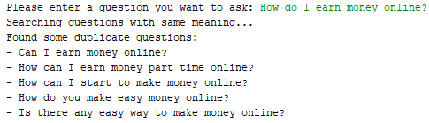

# Projects


All four projects were created with PyCharm and Python 3.6.0.
- Baseline: This project contains my first approaches with simple implementations like:
	- RandomComparer: assigns an random value between 0 and 1 to each questionpair
	- EqualComparer: assigns the value 1 to each questionpair 

- Dataanalysis: This project I used to analyse the test- and trainingsset: charcount, wordcount, most frequently words.

- Evaluation: This project was used to calculate the logloss and get the features which occured in an selection of iterations.

- Main: This project contains all sourcecode for the approach I described earlier. To execute the evaluation you need to run the script_evaluation-Python file. For predicting the testset you can run script_full.
	- Application:
	I created an simple console-application for my final model, in which an user can enter a question of the validationset an gets equal questions as an list in return. This is implementated in the find_common_questions_v2 file.

	<p align="center">
	  
	</p>

	The first version creates a new dataset which contains your question (which can be any question) combined with all questions of the trainingsset as questionpairs. This new set is gonna be predicted and the pairs with the highest predictions are returned. Unfortunality the results were not good enough, so I have to implement the second version.

## Getting Started

1. Get the datasets from kaggle.
	- [Download trainset](https://www.kaggle.com/c/quora-question-pairs/download/train.csv.zip)  
	- [Download testset](https://www.kaggle.com/c/quora-question-pairs/download/test.csv.zip) 

2. Unzip the two downloaded csv-files for example to `/data`.

3. Create a file `data_root` in the directory `/config`.

4. Insert your root path to your data files in the first line of `data_root` (required)
	- on windows e.g. `D:/datasets/quora`
	- on linux e.g. `/datasets/quora`

5. Insert path for [stanford-postagger](https://nlp.stanford.edu/software/tagger.shtml#Download) in the second line of `data_root` (optional)
	- on windows e.g. `C:/stanford-postagger-full-2017-06-09/stanford-postagger.jar`
	- on linux e.g. `/code/libs/stanford-postagger-full-2017-06-09/stanford-postagger.jar`

6. Insert path for java in the third line of `data_root` (optional)
	- on windows e.g. `C:/Program Files/Java/jdk1.8.0_101`
	- on linux e.g. `/usr/lib/jvm/java-8-openjdk-amd64/bin/java`

7. Create the folders `/features`, `/submissions`, `/evaluation` and `/evaluation/runs` in your data directory.

8. Install all required python libraries. You can use the following command:
	```shell
	pip install pandas sklearn matplotlib fuzzywuzzy nltk numpy editdistance python-Levenshtein
	```

9. For faster training install xgboost with gpu-support
	- on windows you find an intruction [here](http://www.picnet.com.au/blogs/guido/post/2016/09/22/xgboost-windows-x64-binaries-for-download/).
	- on linux you find an instruction [here](https://github.com/dmlc/xgboost/blob/master/doc/build.md), td;tr:
		- install cuda toolkit form [here](https://developer.nvidia.com/cuda-downloads?target_os=Linux)
		- if you have old version of cmake: deinstall old version and install new version from [here](https://cmake.org/download/) to usr/local/bin
		- open terminal in e.g. `/lib`
		```shell
		git clone --recursive https://github.com/dmlc/xgboost
		cd xgboost; make -j4
		cd build
		/usr/local/bin/cmake .. -DUSE_CUDA=ON
		make -j
		cd ..
		cd python-package; sudo python setup.py install
		```
	
10. Finally run script_evaluation.py

# Acknowledgement
Got inspirations from:
- http://github.com/Wrosinski/Kaggle-Quora
- http://github.com/aerdem4/kaggle-quora-dup
- http://github.com/prischu/quora_question_pairs
- http://kaggle.com/c/quora-question-pairs/discussion/34342
- http://kaggle.com/sudalairajkumar/simple-leaky-exploration-notebook-quora
- http://linkedin.com/pulse/kaggle-quora-question-pairs-mar-2017-may-priscilla-li